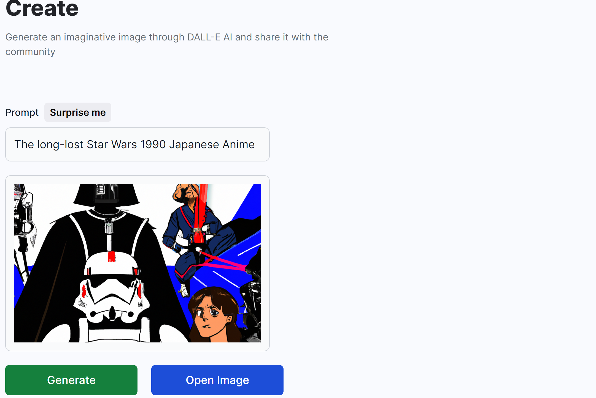
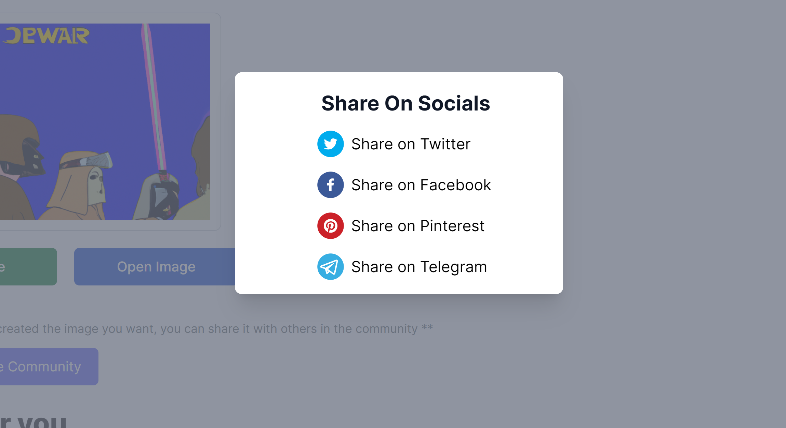

<h1 align ='center'><strong>AI Image Generator ⚡</strong></h1>

<p>An AI generator based on openai resources.</p>

#### **Live Demo:**

https://ai-image-gen-tau.vercel.app/

## **Main technologies 📝**

- Front-End

  - ReactJs
  - Vite.Js
  - TypeScript
  - Tailwind CSS

- Back-End
  - Node.js
  - Express
  - MongoDB
  - Cloudinary

## **Features 🚀**

- View Images Ideas
- Generate Images from description
- Share with Socials
- Download Images

## **Previews 📁**





## **Install 🔨**

1. Clone Project

```sh
  git clone
```

2. Install Packages

```sh
  yarn install | npm install
```

4. Using

```sh
  yarn dev | npm run dev
```
